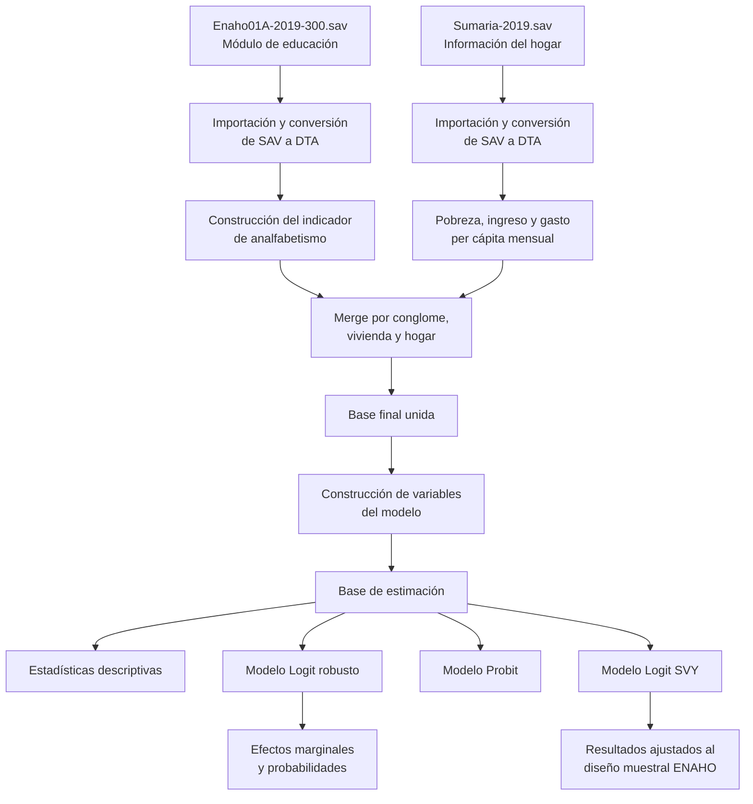

<div align="center">

# 📊 Medición de la tasa de analfabetismo en el Perú

### Evidencia a partir de los microdatos de la ENAHO 2019


<br>

**Laboratorio de Econometría con Stata**

**Docente: Alexandra Otero**

*Procesamiento, integración y análisis econométrico de los microdatos de la Encuesta Nacional de Hogares.*

</div>

---

## 🔎 Descripción del proyecto

Este repositorio contiene el desarrollo completo del proyecto **“Medición de la tasa de analfabetismo en el Perú con la Encuesta Nacional de Hogares”**.

El objetivo es construir un indicador de analfabetismo para la población de **15 años a más** y analizar cómo su probabilidad se relaciona con el sexo, la edad, el área de residencia, la pobreza monetaria y el ingreso per cápita del hogar.

Para ello, se utilizaron los microdatos de la **Encuesta Nacional de Hogares — ENAHO 2019**, específicamente el módulo de educación y la base Sumaria. Los archivos originales fueron importados desde formato SPSS (`.sav`), convertidos a formato Stata (`.dta`), depurados, transformados y unidos mediante los identificadores del hogar.

> [!IMPORTANT]
> El análisis no utiliza directamente las bases originales sin procesar. Primero se construyen bases intermedias y, posteriormente, una base final preparada específicamente para la estimación econométrica.

---

## ✨ Principales resultados

Los resultados muestran una diferencia clara en la probabilidad estimada de analfabetismo según el **sexo** y el **área de residencia**.

La probabilidad es mayor entre las mujeres que entre los hombres y se incrementa considerablemente en el área rural. La combinación de ambos factores identifica a las **mujeres rurales** como el grupo con la mayor probabilidad ajustada de analfabetismo.

<table>
<tr>
<td width="50%" align="center">

### Modelo Logit


</td>
<td width="50%" align="center">

### Modelo con diseño muestral ENAHO


</td>
</tr>
</table>

### Interpretación general

En el modelo Logit con errores estándar robustos, la probabilidad estimada pasa aproximadamente de:

| Grupo | Probabilidad aproximada |
|:---|---:|
| Hombre urbano | 3 % |
| Hombre rural | 6 % |
| Mujer urbana | 8 % |
| Mujer rural | 19 % |

Al incorporar el diseño muestral complejo de la ENAHO, las probabilidades ajustadas son aproximadamente:

| Grupo | Probabilidad aproximada |
|:---|---:|
| Hombre urbano | 2 % |
| Hombre rural | 4 % |
| Mujer urbana | 6 % |
| Mujer rural | 14 % |

> [!NOTE]
> Los valores anteriores son aproximaciones visuales obtenidas de los gráficos. Las estimaciones exactas y sus errores estándar se generan al ejecutar los comandos `margins` de los do-files `07_modelo_logit.do` y `08_modelos_svy.do`.

---

## 🎯 Objetivo

Estimar la probabilidad de que una persona de 15 años a más se encuentre en condición de analfabetismo en el Perú durante 2019, considerando características personales, territoriales y socioeconómicas.

La variable dependiente se define como:

\[
Analfabeto_i =
\begin{cases}
1, & \text{si la persona tiene 15 años o más y no sabe leer ni escribir} \\
0, & \text{si la persona tiene 15 años o más y sabe leer y escribir}
\end{cases}
\]

---

## 🗂️ Fuentes de información

Se emplearon dos bases de los microdatos de la **ENAHO 2019**:

| Base original | Módulo | Unidad de análisis | Uso en el proyecto |
|:---|:---|:---|:---|
| `Enaho01A-2019-300.sav` | Módulo 300: Educación | Persona | Construcción del indicador de analfabetismo y variables individuales |
| `Sumaria-2019.sav` | Sumaria | Hogar | Pobreza, ingreso, gasto e información geográfica y muestral |

### Transformaciones realizadas

- Importación de las bases originales en formato SPSS.
- Conversión de archivos `.sav` a archivos `.dta`.
- Conversión de los nombres de variables a minúsculas.
- Construcción del indicador binario de analfabetismo.
- Construcción de pobreza monetaria binaria.
- Cálculo del ingreso y gasto per cápita mensual.
- Selección de variables necesarias para reducir el tamaño de Sumaria.
- Validación de los identificadores únicos.
- Unión del módulo de educación con Sumaria.
- Construcción de las variables del modelo.
- Verificación de valores perdidos y muestra disponible.
- Estimación de modelos Logit, Probit y Logit con diseño muestral.

---

## 🔄 Flujo de procesamiento



---

## 🧮 Metodología econométrica

La probabilidad de que una persona sea analfabeta se estima mediante un modelo Logit:

```text
P(Analfabeto = 1 | X) =
Λ(β₀ + β₁ Mujer + β₂ Edad + β₃ Edad²
  + β₄ Rural + β₅ Pobre
  + β₆ ln(Ingreso per cápita))
```

donde:

- **Mujer** = 1 si la persona es mujer.
- **Edad** = edad en años.
- **Edad²** = término cuadrático de la edad.
- **Rural** = 1 si reside en área rural.
- **Pobre** = 1 si pertenece a un hogar pobre.
- **ln(Ingreso per cápita)** = logaritmo natural del ingreso per cápita del hogar.

La función Λ representa la función logística acumulada utilizada por el modelo Logit.

### Modelos estimados

1. **Logit con errores estándar robustos.**
2. **Logit expresado mediante odds ratios.**
3. **Efectos marginales promedio.**
4. **Logit con interacción entre mujer y área rural.**
5. **Probit como comprobación de robustez.**
6. **Logit con diseño muestral complejo mediante `svy`.**

Para el modelo final se declara el diseño muestral de la ENAHO mediante:

```stata
svyset conglome [pweight=factora07], strata(estrato)
```

Esto permite considerar los conglomerados, los estratos y los factores de expansión de la encuesta.

---

## 🧹 Preparación de la información

El procesamiento se diseñó para mantener una secuencia reproducible.

### 1. Módulo de educación

La base `Enaho01A-2019-300.sav` se importa desde SPSS y se convierte en:

```text
Enaho01A-2019-300.dta
```

Posteriormente, se construye la variable `analfabeto` para personas de 15 años a más y se obtiene:

```text
base_analfabetismo_2019.dta
```

### 2. Base Sumaria

La base `Sumaria-2019.sav` se importa, limpia y transforma. A partir de ella se crean:

- condición de pobreza;
- ingreso per cápita mensual;
- gasto per cápita mensual;
- variables geográficas;
- variables necesarias para el diseño muestral.

La base reducida resultante es:

```text
sumaria_2019_reducida.dta
```

### 3. Unión de las bases

El módulo de educación se une con Sumaria utilizando:

```stata
merge m:1 conglome vivienda hogar
```

Solo se conservan las observaciones correctamente vinculadas. La base resultante es:

```text
base_final_analfabetismo_2019.dta
```

### 4. Base del modelo

Sobre la base final se construyen las variables explicativas y se genera:

```text
base_modelo_analfabetismo_2019.dta
```

Esta es la base utilizada por los scripts de estadísticas descriptivas y estimación econométrica.

---

## 📁 Estructura del repositorio

```text
PROYECTO_FINAL_LAB_STATA/
│
├── BASE DE DATOS/
│   ├── 687-Modulo03/
│   │   ├── Enaho01A-2019-300.sav
│   │   ├── Enaho01A-2019-300.dta
│   │   ├── base_analfabetismo_2019.dta
│   │   ├── diccionarios y documentación
│   │   └── archivos auxiliares
│   │
│   ├── 687-Modulo34/
│   │   ├── Sumaria-2019.sav
│   │   ├── Sumaria-2019.dta
│   │   ├── sumaria_2019_reducida.dta
│   │   ├── diccionarios y documentación
│   │   └── archivos auxiliares
│   │
│   ├── base_final_analfabetismo_2019.dta
│   ├── base_modelo_analfabetismo_2019.dta
│   ├── probabilidad_logit_mujer_rural.png
│   └── probabilidad_svy_mujer_rural.png
│
├── RESULTADOS/
│   ├── 00_master.do
│   ├── 01_importar_educacion.do
│   ├── 02_construir_indicador.do
│   ├── 03_preparar_sumaria.do
│   ├── 04_merge_bases.do
│   ├── 05_construir_variables.do
│   ├── 06_descriptivos.do
│   ├── 07_modelo_logit.do
│   └── 08_modelos_svy.do
│
├── LICENSE
└── README.md
```

---

## ▶️ Cómo reproducir el análisis

### Requisitos

- Stata instalado.
- Acceso a las bases ENAHO 2019.
- Archivos `.do` y bases almacenados en las carpetas correspondientes.
- Git LFS instalado para descargar correctamente los archivos `.dta` de gran tamaño.

### Ejecución principal

El archivo principal del proyecto es:

```text
RESULTADOS/00_master.do
```

Este archivo debe utilizarse como punto de entrada para ejecutar ordenadamente los demás programas.

Antes de ejecutarlo, se debe revisar y adaptar la ruta principal del proyecto:

```stata
global root "C:\Users\USER\Documents\STATA_LAB"
```

Después, el flujo completo sigue este orden:

```stata
do "01_importar_educacion.do"
do "02_construir_indicador.do"
do "03_preparar_sumaria.do"
do "04_merge_bases.do"
do "05_construir_variables.do"
do "06_descriptivos.do"
do "07_modelo_logit.do"
do "08_modelos_svy.do"
```

> [!WARNING]
> Las rutas absolutas deben modificarse según la ubicación del proyecto en cada computadora. No se recomienda ejecutar únicamente los últimos archivos si las bases intermedias todavía no han sido creadas.

<details>
<summary><strong>Ver función de cada do-file</strong></summary>

<br>

| Orden | Archivo | Función |
|:---:|:---|:---|
| 00 | `00_master.do` | Organiza y ejecuta la secuencia completa del proyecto |
| 01 | `01_importar_educacion.do` | Importa el módulo de educación desde SPSS y lo guarda en Stata |
| 02 | `02_construir_indicador.do` | Construye el indicador binario de analfabetismo |
| 03 | `03_preparar_sumaria.do` | Prepara Sumaria y genera variables económicas del hogar |
| 04 | `04_merge_bases.do` | Une la base individual con la base del hogar |
| 05 | `05_construir_variables.do` | Construye las variables utilizadas en la estimación |
| 06 | `06_descriptivos.do` | Calcula estadísticas descriptivas ponderadas |
| 07 | `07_modelo_logit.do` | Estima Logit, efectos marginales, interacción y Probit |
| 08 | `08_modelos_svy.do` | Estima el modelo final considerando el diseño muestral |

</details>

---

## ✅ Estado del proyecto

- [x] Descarga y organización de los microdatos de la ENAHO 2019
- [x] Importación de archivos SPSS
- [x] Conversión de `.sav` a `.dta`
- [x] Limpieza y selección de variables
- [x] Construcción del indicador de analfabetismo
- [x] Preparación de la base Sumaria
- [x] Unión de las bases individuales y del hogar
- [x] Construcción de la base final del modelo
- [x] Estadísticas descriptivas ponderadas
- [x] Estimación del modelo Logit
- [x] Estimación del modelo Probit como robustez
- [x] Incorporación del diseño muestral complejo
- [x] Cálculo de efectos marginales
- [x] Exportación de gráficos
- [x] Documentación del repositorio

---

## 👥 Equipo de trabajo

| Participante | Contribución general |
|:---|:---|
| **Lileya Manzano** | Procesamiento, estimación y documentación |
| **Piero Laime** | Procesamiento, revisión y documentación |
| **Luis Puicón** | Procesamiento, revisión y documentación |
| **Melissa Quispe** | Procesamiento, revisión y documentación |
| **Andres Avila** | Procesamiento, revisión y documentación |

El proyecto fue desarrollado de manera colaborativa como parte del curso de **Laboratorio de Econometría con Stata**.

---

## 📌 Conclusión

La evidencia obtenida indica que el analfabetismo en el Perú durante 2019 presentó diferencias importantes según el sexo y el área de residencia. En particular, las mujeres rurales registran la mayor probabilidad estimada de encontrarse en condición de analfabetismo.

El ejercicio también muestra la importancia de considerar el diseño muestral complejo de la ENAHO. Al incorporar conglomerados, estratos y factores de expansión, se obtienen estimaciones ajustadas a la estructura de la encuesta y, por tanto, más adecuadas para realizar inferencia sobre la población peruana.

Además del resultado econométrico, el repositorio documenta un flujo reproducible de procesamiento de microdatos: desde la importación de archivos SPSS hasta la construcción de indicadores, la integración de bases y la estimación final.

---

<div align="center">

### 📚 Proyecto final — Laboratorio de Econometría con Stata

**Microdatos ENAHO 2019 · Analfabetismo · Logit · Diseño muestral complejo**

<br>


</div>
